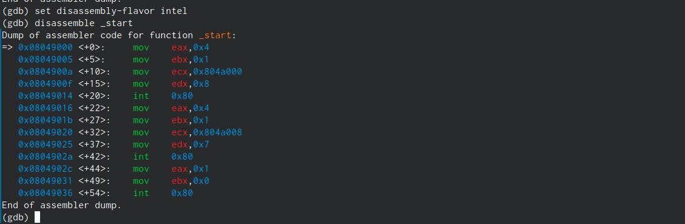

---
## Front matter
title: "Отчёт по лабораторной работе №9"
subtitle: "Простейший вариант"
author: "Бадалов Заури Эльвин оглы"

## Generic otions
lang: ru-RU
toc-title: "Содержание"

## Bibliography
bibliography: bib/cite.bib
csl: pandoc/csl/gost-r-7-0-5-2008-numeric.csl

## Pdf output format
toc: true # Table of contents
toc-depth: 2
lof: true # List of figures
lot: true # List of tables
fontsize: 12pt
linestretch: 1.5
papersize: a4
documentclass: scrreprt
## I18n polyglossia
polyglossia-lang:
  name: russian
  options:
	- spelling=modern
	- babelshorthands=true
polyglossia-otherlangs:
  name: english
## I18n babel
babel-lang: russian
babel-otherlangs: english
## Fonts
mainfont: PT Serif
romanfont: PT Serif
sansfont: PT Sans
monofont: PT Mono
mainfontoptions: Ligatures=TeX
romanfontoptions: Ligatures=TeX
sansfontoptions: Ligatures=TeX,Scale=MatchLowercase
monofontoptions: Scale=MatchLowercase,Scale=0.9
## Biblatex
biblatex: true
biblio-style: "gost-numeric"
biblatexoptions:
  - parentracker=true
  - backend=biber
  - hyperref=auto
  - language=auto
  - autolang=other*
  - citestyle=gost-numeric
## Pandoc-crossref LaTeX customization
figureTitle: "Рис."
tableTitle: "Таблица"
listingTitle: "Листинг"
lofTitle: "Список иллюстраций"
lotTitle: "Список таблиц"
lolTitle: "Листинги"
## Misc options
indent: true
header-includes:
  - \usepackage{indentfirst}
  - \usepackage{float} # keep figures where there are in the text
  - \floatplacement{figure}{H} # keep figures where there are in the text
---

# Цель работы

Освоить работу с подпрограммами и отладчиком gdb.

# Задание

Здесь приводится описание задания в соответствии с рекомендациями
методического пособия и выданным вариантом.

# Выполнение лабораторной работы

Создаю рабочую директорию и файл. Записываю туда программу из листинга, исправив опечатки. (рис. @fig:001).

{#fig:001 width=70%}

Проверяю работу программы. (рис. @fig:002).

{#fig:002 width=70%}

Вношу текст программы, имитирующей сложную функцию. Функции назову _calcul и _subcalcul (рис. @fig:003).

{#fig:003 width=70%}

Проверяю работу программы. (рис. @fig:004).

{#fig:004 width=70%}

Создаю файл lab09-2.asm и ввожу в него текст программы. (рис. @fig:005).

{#fig:005 width=70%}

Транслирую файл с ключом -g. После загружаю исполняемый файл в отладчик gdb. Проверяю его работу запустив ее в отладчике gdb командой run. (рис. @fig:006).

{#fig:006 width=70%}

Устанавливаю брейкпоинт на метку _start и запускаю ассемблерную программу. (рис. @fig:007).

{#fig:007 width=70%}

Смотрю дисассимилированный код программы, использую команду disassemble, начиная с метки _start. (рис. @fig:008).

{#fig:008 width=70%}

Переключаюсь на отображение команд с Intel'овским синтаксисом. (рис. @fig:009).

{#fig:009 width=70%}

В представлении ATT в виде 16-ричного числа записаны первые аргументы всех комманд, а в представлении Intel так записываются адреса вторых аргументов.
Включим режим псевдографики, при помощи которого отображается код программы и содержимое регистров. (рис. @fig:0010).

{#fig:0010 width=70%}

Вывожу значения регистров, используя команду i r. (рис. @fig:0011).

{#fig:0011 width=70%}

В отладчике можно вывести текущие значения переменных. Сделать это можно, к примеру, по имени (рис. @fig:0012) или по адресу (рис. @fig:0013).

{#fig:0012 width=70%}

{#fig:0013 width=70%}

Так же отладчик даёт менять значения переменных прямо во время выполнения программы. (рис. @fig:0014).

{#fig:0014 width=70%}

Заменю первый символ переменной msg2 на символ отступа. (рис. @fig:0015).

{#fig:0015 width=70%}

Выведу значение регистра edx в разных форматах: строчном, 16-ричном, двоичном. (рис. @fig:0016).

{#fig:0016 width=70%}

Регистрам тоже можно задавать значения. (рис. @fig:0017).

{#fig:0017 width=70%}

Однако при попытке задать строчное значение, происходит ошибка. Завершу работу в gdb командами continue, она закончит выполнение программы, и exit, она завершит сеанс gdb.

Скопирую файл из лабораторной работы №9, переименую и создаю исполняемый файл. Открываю отладчик и задаю аргументы. Создаю точку останова на метке _start и запускаю программу. (рис. @fig:0018).

{#fig:0018 width=70%}

Смотрю на содержимое того, что расположено по адресу, находящемуся в регисре esp. (рис. @fig:0019).

{#fig:0019 width=70%} 

Далее смотрю на все остальные аргументы в стеке. Их адреса распологаются в 4 байтах друг от друга (именно столько занимает элемент стека). (рис. @fig:0020).

{#fig:0020 width=70%} 

#Задания самостоятельной работы

Программа из лабораторной работы №8 с использованием подпрограмм. (рис. @fig:0021).

{#fig:0021 width=70%} 

Проверяю результат выполнения работы программы. (рис. @fig:0022).

{#fig:0022 width=70%} 

Редактирую текст программы из листинга 9.3 в новом файле zadan9-1.asm после просмотра регистров для поиска ошибки. (рис. @fig:0023).

{#fig:0023 width=70%} 

Проверяю работу программы. (рис. @fig:0024).

{#fig:0024 width=70%} 

# Вывод

Я освоил работу с подпрограммами и отладчиком gdb.

